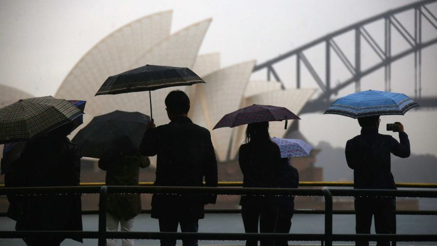

# Will you have a G'-not rainy-DAY tomorrow, mate? :sunny: :sun_behind_small_cloud: :partly_sunny: :sun_behind_rain_cloud: :cloud_with_rain:

Repository includes: 
* Streamlit integration as a prediction to weather forecast
* Juyter notebooks for assessing weather predictions
* Relevant datasets, library requirements and pictures 

### Wait, how certain you are that it's gonna rain or not in the Down Under? :kangaroo:

Every day at 6pm(ish), Australia's favourite machine learning algorithm, Light GBM, will advise on whether aussies should leave their umbrellas home or not.

Leveraging data from weather stations across the nation (Outback included!), Light GBM has an outstanding **~85% accuracy** on its forecasts by taking into account the widely variety of inherent climates features.

### RIPPER, mate! I'm curious now.... How does this robot work afterall? :robot:

**Glad you asked!** 
Similarly to climbing Mt. Everest (or should I say Mt. Kosciuszko), our robot was performed by reaching two important milestones:

## Phase 1 (aka reaching base camp :basecamp:): Defining a baseline model to predict whether it will rain or not:

**:warning: Technical lingo ahead!**
* Baseline model was derived from X consecutive workstreams, available at the 'final_sprint' notebook:
>* **Stream 1, Gathering data**: Rain and wind data were merged into a single dataframe 
>* **Stream 2, Feature engineering**: Some features (eg., season of the year) were then added to the single dataframe for the robot to understand whether they are relevant or not. Further, **some features were dropped as they would leak data** (eg., min temp and max temp would not be available at 6pm for weather forecasting) or would not help on building the model (eg., feature 'modelo_vigente)
>* **Stream 3, City clustering**: The 'location' feature is indeed categorical, but it should be clustered! After all, 'Perth' and 'Perth Airport' should have very similiar weather conditions. By leveraging KMeans, **the 'location' feature was clustered according to geographical proximity**: 40 locations were then consolidated into 11 clusters.
>* **Stream 4, PyCarat saved the day!**: Before Pycarat saved the day, dataset was split into 95/5 train-test/unseen datasets. Pycarat library was then responsible for coming up with the best machine learning algorithm. Light GBM, the chosen model, was then tuned to derive a better estimator for the problem
>* **Stream 5, all confusion is not created equal**: **Confusion matrix quadrants were then calibrated according to their respective cost curves**. After all, the cost of false negatives (ie., predicting it does not rain tomorrow but it actually does) is far greater than the cost of false positives (ie., predicting it rains tomorrow but it actually does not). Putting in other worsd, **in the first case, aussies would be stuck on a rainy day without an umbrella!** In the latter case, aussies would only be carrying an unnecessary umbrella in their backpacks 
>* **Stream 6, the last dance**: By taking into account a revised probability threshold, model was then finalized and tested on the 5% unseeen data (remember it, from stream 4?), resulting in an impressive **80% recall score**, aiming at **83% accuracy**

## Phase 2 (aka reaching the summit :mountain:): Tuning the model and making it available at Streamlit

* Unfortunately, RA's website can only be scrapped using selenium, which slows down the overall process
* Scraping process was divided into two consequent streams:
>* **Stream 1**: Selenium gathered all the complaint links of PagSeguro available at RA: ~50k links were then consolidated into .txt files (RA allows selenium to scrape 10 links per interaction)  

>* **Stream 2**: Selenium then opened each complaint link to gather useful data for later parsing - more especifically: complaint title, body, status, date, city/state of the client

